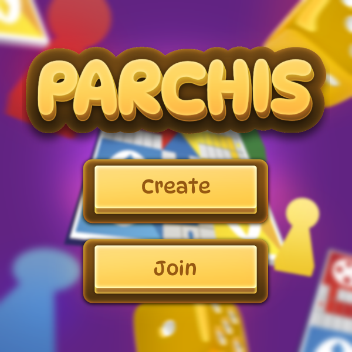
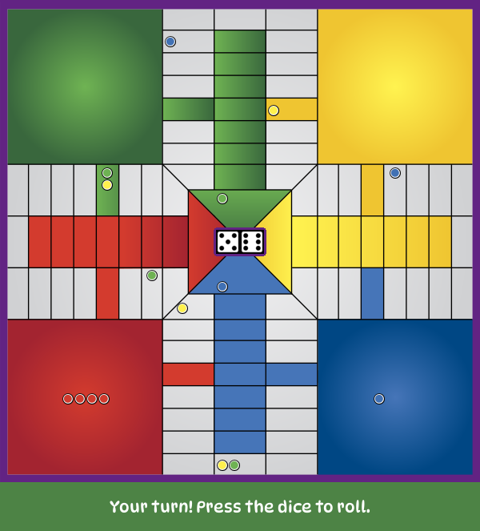
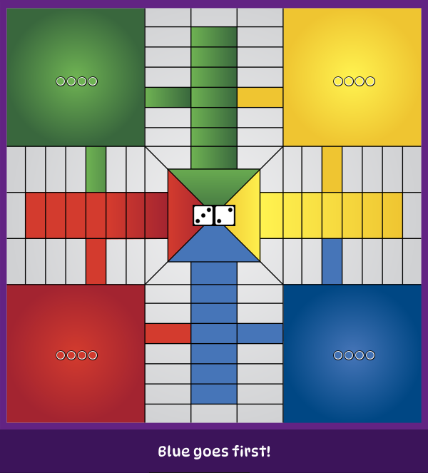

# 🎲 Distributed Parchís

A fully playable **Parchís** game built as a distributed system, all game logic runs on a central server that manages multiple simultaneous games and communicates with clients over **TCP sockets** using a custom JSON protocol.

Built as a course project for **Distributed Systems** at Universidad Tecnológica de Pereira.

---

## Screenshots

| Main Menu | Game Board | Turn Ceremony |
|-----------|------------|--------------|
|  |  |  |

---

## Features

- 2–4 players per game, multiple simultaneous games on the same server
- Full Parchís ruleset: jails, safe cells, final paths, piece capture, and win detection
- Turn-order ceremony: players roll to determine who goes first
- Pair dice rules: doubles release jailed pieces and grant an extra turn
- Real-time board updates broadcast to all players in a game after every action
- Pygame-based graphical client with clickable pieces and dice

---

## Architecture

The system follows a **thin-client** model: the server owns all game state and enforces every rule. Clients are responsible only for rendering and forwarding user input.

```
┌─────────────┐        TCP / JSON        ┌──────────────────────────────┐
│   Client A  │ ◄──────────────────────► │                              │
├─────────────┤                          │          Server              │
│   Client B  │ ◄──────────────────────► │                              │
├─────────────┤                          │  ┌─────────┐  ┌──────────┐   │
│   Client C  │ ◄──────────────────────► │  │  Game 1 │  │  Game 2  │   │
└─────────────┘                          │  └─────────┘  └──────────┘   │
                                         └──────────────────────────────┘
```

### Concurrency model

Each connected client is handled by a dedicated `ReceiveThread`. Responses are dispatched through `ResponseThread` instances, keeping I/O non-blocking. On the client side, a daemon thread feeds incoming messages into a `queue.Queue`, decoupling network I/O from the Pygame render loop.

### Message protocol

Communication uses a newline-delimited JSON protocol (`\n` as message boundary). Every message carries a numeric `code` field:

| Direction | Code | Meaning |
|-----------|------|---------|
| Client → Server | `1` | Create a new game |
| Client → Server | `2` | Join an existing game (by PIN) |
| Client → Server | `3` | Start the game (host only) |
| Client → Server | `4` | Leave the game |
| Client → Server | `6` | Roll dice (normal turn) |
| Client → Server | `7` | Move a piece (`piece_id` + `dice_index`) |
| Client → Server | `8` | Roll dice (turn-order ceremony) |
| Server → Client | `9` | Turn-order ceremony update |
| Server → Client | `10` | Turn notification + board snapshot |
| Server → Client | `11` | Dice rolled + board snapshot |
| Server → Client | `33` | Turn skipped (no available pieces) |
| Server → Client | `34` | Game over (winner declared) |
| Server → Client | `35` | Move accepted, one die remaining |
| Server → Client | `36` | Move accepted, turn ends |
| Server → Client | `40/41/42` | Error responses |

### Board representation

The main track has **68 cells** (numbered 1–68). Each player has a **final path** of 7 cells (101–107), with cell 108 as the finish. Pieces are identified as `player_id * 10 + offset` (e.g. player 1 owns pieces 11–14), which allows the server to derive ownership from the piece ID alone.

---

## Project Structure

```
parchis/
├── server/
│   ├── main.py                        # Entry point; connects clients and routes messages
│   └── core/
│       ├── network/
│       │   ├── server.py              # Base TCP server (accept, send, receive, threads)
│       │   ├── parchis_server.py      # Protocol handlers (create_game, move_piece, …)
│       │   └── thread.py             # ReceiveThread / ResponseThread
│       └── game_logic/
│           ├── game.py               # Turn management, dice state, win detection
│           ├── board.py              # Cell map, movement, capture, final paths
│           ├── player.py             # Player model
│           ├── piece.py              # Piece model
│           └── dice.py              # Dice roll and pair detection
└── client/
    ├── main.py                        # Entry point; connects to server and opens UI
    └── core/
        ├── network/
        │   ├── client.py             # Base TCP client (buffered receive)
        │   └── parchis_client.py     # Protocol methods (roll_dice, move_piece, …)
        └── view/
            ├── view.py               # Pygame screens and game loop
            └── board_map.py          # Pixel coordinates for every cell and jail
```

---

## Getting Started

### Requirements

- Python 3.10 – 3.12 (Python 3.13+ is not supported due to a Pygame compatibility issue)
- Two separate terminals (or machines): one for the server and one per client

### Install dependencies

**Server:**
```bash
cd server
pip install -r requirements.txt
```

**Client:**
```bash
cd client
pip install -r requirements.txt
```

### Run the server

```bash
cd server
python main.py <IP> <PORT>

# Example (local):
python main.py 127.0.0.1 5050
```

### Run a client

```bash
cd client
python main.py <SERVER_IP> <SERVER_PORT>

# Example:
python main.py 127.0.0.1 5050
```

Launch at least **2 clients** to start a game. One player creates a game and shares the 5-digit PIN; the others join with that PIN. The host then starts the game.

---

## How to Play

1. **Create or join** a game from the main menu.
2. During the **turn-order ceremony**, each player clicks the dice to roll and highest total goes first.
3. On your turn, **click the dice** to roll.
4. **Click a piece** to move it using the left die, then click again for the right die.
5. Rolling **doubles** releases a jailed piece (if any) and grants an extra turn.
6. Land on an opponent's piece to **send it back to jail** (safe cells are protected).
7. First player to get all 4 pieces to the finish wins.

---

## Tech Stack

| | |
|---|---|
| Language | Python 3.10 – 3.12 |
| Networking | `socket` (TCP) |
| Concurrency | `threading` |
| Client UI | Pygame |
| Serialization | JSON |
| Server logging | Rich |
